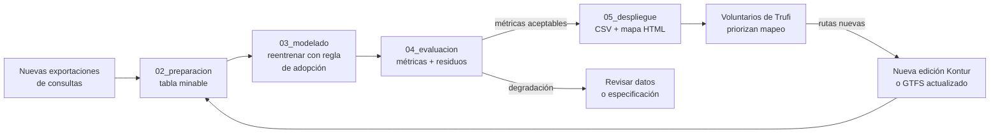

# 05 · Despliegue (sección 7.6)

> **[SUPERADO — 2026-09-27]** Reemplazado por el protocolo predictivo de las Fases 4–6 registrado en `reports/03_modelado/DECISIONES_03_modelado.md`, `reports/04_evaluacion/DECISIONES_04_evaluacion.md` y `reports/05_despliegue/DECISIONES_05_despliegue.md`. Se conserva como antecedente.

La guía acepta una propuesta técnicamente fundamentada cuando no es posible un despliegue completo. Los entregables siguientes son pequeños, se generan desde un notebook y ya constituyen un producto usable por Trufi.

## Entregables mínimos (en orden de prioridad)

| # | Entregable | Formato | Esfuerzo | Para quién |
|---|---|---|---|---|
| 1 | Archivo de predicciones por celda | `predicciones_celdas.csv` + `.geojson` | Bajo | Técnico / SIG |
| 2 | Mapa interactivo | `mapa_brecha.html` (folium, un solo archivo) | Bajo | Voluntarios |
| 3 | Lista de celdas prioritarias | `top_celdas_prioritarias.csv` / tabla en anexo | Muy bajo | Coordinación de mapeo |
| 4 | Notebook reproducible + README | `05_despliegue.ipynb` | Bajo | Quien actualice el análisis |
| 5 | Publicación del mapa | GitHub Pages del repositorio | Muy bajo | Público |

Opcional si sobra tiempo: una app Streamlit con filtro por municipio. No es necesaria para cumplir OE5.

### 1. Columnas del archivo de predicciones

`h3, lat, lon, pop, n_consultas, y_esperado, ic_inf, ic_sup, resid_pearson, categoria_brecha, cubierta, dist_parada_m, en_prueba, modelo, fecha_modelo`

- `categoria_brecha`: "menos de lo esperado" si `resid_pearson < −2`, "según lo esperado" entre −2 y 2, "más de lo esperado" si > 2. Umbral simple de explicar.
- `en_prueba`: permite distinguir celdas cuya predicción fue fuera de muestra.

### 2. Mapa HTML (capas)

1. Consultas observadas por 1.000 habitantes.
2. Consultas esperadas.
3. Residuo de Pearson (escala divergente).
4. Cobertura GTFS (paradas o celdas cubiertas).
5. Polos de actividad (celdas sin población con consultas), como capa aparte.

```python
import folium, branca.colormap as cm
m = folium.Map(location=[-17.39, -66.16], zoom_start=12, tiles="cartodbpositron")
cmap = cm.LinearColormap(["#b2182b", "#f7f7f7", "#2166ac"], vmin=-4, vmax=4, caption="Residuo de Pearson")
folium.GeoJson(gdf.to_json(), name="Brecha",
    style_function=lambda f: {"fillColor": cmap(max(-4, min(4, f["properties"]["resid_pearson"]))),
                              "color": "none", "fillOpacity": 0.7},
    tooltip=folium.GeoJsonTooltip(["h3", "pop", "n_consultas", "y_esperado", "resid_pearson"])).add_to(m)
cmap.add_to(m); folium.LayerControl().add_to(m)
m.save("reports/05_despliegue/mapa_brecha.html")
```

### 3. Lista de celdas prioritarias

Top 20 celdas con residuo más negativo **y** población por encima de la mediana, con coordenadas y un enlace `https://www.openstreetmap.org/?mlat=..&mlon=..#map=16/..`. Es lo que un voluntario puede usar el mismo día.

## Cómo se consume

Trufi abre el mapa, filtra las celdas "menos de lo esperado" sin cobertura y las cruza con su conocimiento local antes de salir a mapear. El modelo no se consulta en tiempo real: se recalcula por lotes.

## Actualización y monitoreo (diagrama para 7.6.2)



Disparadores de reentrenamiento: nueva edición de Kontur, nuevas rutas en el GTFS o un año de consultas nuevas.

**Validación prospectiva** (texto para 7.6.2): cuando una celda con residuo negativo reciba rutas nuevas, sus consultas en el período siguiente deberían acercarse al valor esperado. Registrar esas celdas permite comprobar, con datos futuros, si el mapa señaló correctamente zonas desatendidas.

## Texto base para 7.6.1

El resultado se entrega en tres productos generados desde el mismo notebook: un archivo con la predicción, el intervalo y el residuo de cada celda; un mapa interactivo en HTML que muestra consultas observadas, esperadas y la diferencia entre ambas junto con la cobertura de rutas; y una lista de las veinte celdas pobladas con mayor déficit de consultas. Estos productos no requieren infraestructura adicional y pueden publicarse en el repositorio del proyecto.
