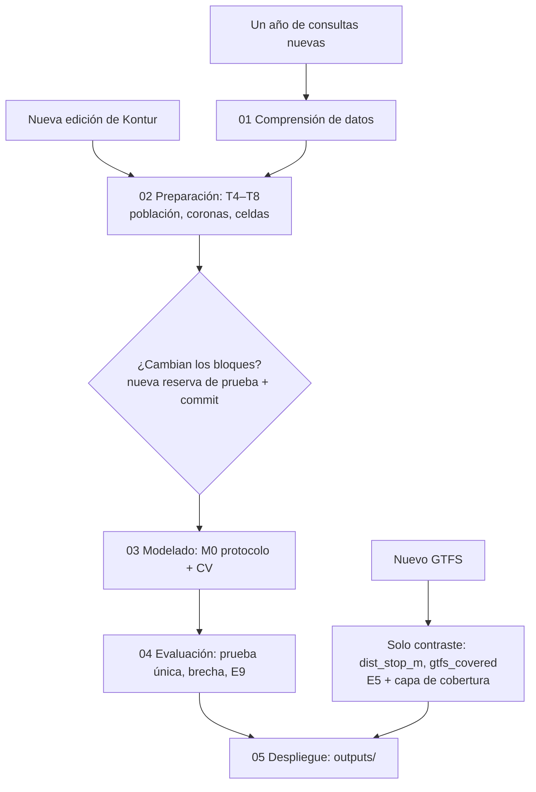

# outputs/ — Productos de despliegue (Fase 6)

Generados por `notebooks/05_despliegue.ipynb` (versión 2026-09-27). Léase primero `MODEL_CARD.md`.

| Archivo | Contenido |
|---|---|
| `predictions_by_cell.csv` | Una fila por celda H3 r8 del modelo: observado, esperado, residuo, `p_low`, categoría, cobertura GTFS |
| `predictions_by_cell.geojson` | Lo mismo con polígonos H3, EPSG:4326 |
| `gap_map.html` | Mapa interactivo (abrir en un navegador; no requiere servidor) |
| `priority_cells.csv` | 20 celdas candidatas a revisar, con enlace a OpenStreetMap |
| `MODEL_CARD.md` | Ficha del modelo: datos, técnica, métricas, limitaciones |

## Cómo regenerar

Desde la raíz del repositorio, con los datos en `data/` (ver `AGENTS.md`):

```bash
uv sync
for nb in 01_comprension_datos 02_preparacion_datos 03_modelado 04_evaluacion 05_despliegue; do
  uv run jupyter nbconvert --to notebook --execute --inplace notebooks/$nb.ipynb
done
```

`04_evaluacion` no reevalúa la prueba si `reports/04_evaluacion/resultados_prueba.csv` ya existe (D-302). Para una
actualización con datos nuevos, archive ese archivo y declare el cambio en `DECISIONES_04_evaluacion.md` **antes**
de ejecutar.

## Cuándo actualizar



| Disparador | Qué se rehace | Por qué |
|---|---|---|
| Nueva edición de Kontur | Etapa 2 (T4–T8) y Fases 4–6 | Cambian la exposición y las coronas de población |
| Nuevo GTFS | Solo `dist_stop_m`, `gtfs_covered`, E5 y la capa de cobertura | GTFS no entra al modelo (D-017) |
| Un año de consultas nuevas | Todo, desde la Etapa 1 | Cambian el objetivo, el área (D-018) y posiblemente los bloques |

## Publicación opcional (GitHub Pages)

No se publicó (D-405). Para hacerlo: copiar `gap_map.html` a `docs/index.html` (o a una rama `gh-pages`), activar
Pages en *Settings → Pages* del repositorio y añadir aquí el enlace. Revíselo antes: el mapa muestra conteos por celda
de una app de terceros.
