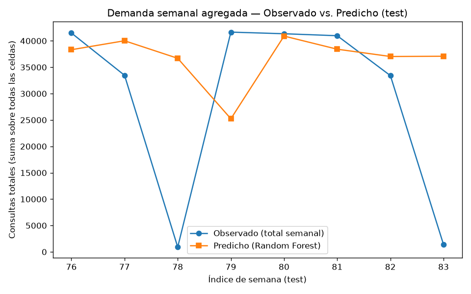
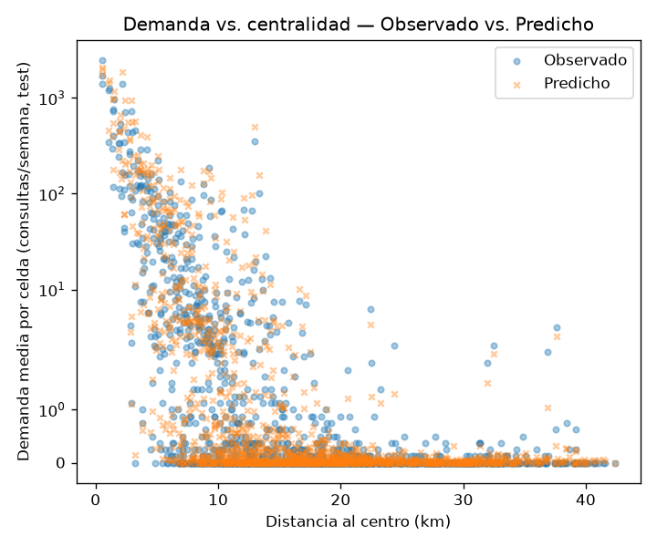

# 7.5.1-7.5.2 Results Analysis Report

Generated by: `src/22_results_analysis.py`

## 1. Métricas definidas y resultados finales por modelo (test set)

Métricas: **MAE** (error absoluto medio, en consultas/semana — interpretable
directamente en la unidad del negocio), **RMSE** (penaliza más los errores
grandes — relevante porque el objetivo es fuertemente asimétrico), **R²**
(proporción de varianza explicada, referencia relativa contra predecir la
media). Justificación completa de la elección de métricas en
`reports/03_modeling/01_model_training.md` § 7.4.1-7.4.2.

| Modelo | MAE | RMSE | R² |
|--------|-----|------|-----|
| random_forest | 10.19 | 80.70 | 0.656 |
| baseline_rolling4 | 11.05 | 85.70 | 0.613 |
| baseline_naive | 11.30 | 91.90 | 0.555 |
| xgboost | 13.85 | 102.82 | 0.442 |
| lasso | 44.03 | 520.76 | -13.305 |
| ridge | 48.97 | 559.13 | -15.491 |

Detalle completo (train + test, todos los modelos y líneas base) en
`reports/03_modeling/02_model_comparison.md`.

## 2. Demanda semanal agregada — Observado vs. Predicho (test)

| Semana (índice) | Semana (calendario) | Total observado | Total predicho (Random Forest) | Diferencia |
|-------------------|------------------------|-------------------|----------------------------------------|------------|
| 76 | 2024-W09 | 41492 | 38319 | -3173 |
| 77 | 2024-W10 | 33469 | 40016 | +6547 |
| 78 | 2024-W18 | 909 | 36693 | +35784 |
| 79 | 2024-W19 | 41656 | 25232 | -16424 |
| 80 | 2024-W20 | 41347 | 40906 | -441 |
| 81 | 2024-W21 | 40973 | 38417 | -2556 |
| 82 | 2024-W22 | 33412 | 37036 | +3624 |
| 83 | 2024-W23 | 1367 | 37081 | +35714 |

El modelo sigue razonablemente la tendencia agregada semana a semana, pero
el detalle celda por celda (Sección 3 y `21_hypothesis_tests.py`) muestra
que esa cercanía agregada esconde heterogeneidad real: el modelo acierta
mucho mejor en celdas de alta demanda que en celdas marginales.

## 3. Ranking espacial: ¿el modelo identifica los mismos hotspots?

- Overlap entre el top-10 de celdas por demanda **observada** y por demanda
  **predicha** (promedio del período de test): **10/10** celdas coinciden.
- Correlación de Spearman entre el ranking de demanda observada y predicha
  (todas las celdas del conjunto de prueba): **ρ = 0.8768** (p=0).

Esto confirma que Random Forest no solo predice bien el *nivel* de
demanda (Sección 7.4-7.5), sino que preserva el *orden relativo* de las
celdas — relevante para cualquier uso de priorización territorial
(Sección 7.6): el modelo puede usarse para rankear celdas por demanda
esperada, no solo para estimar su magnitud puntual.

## 4. Gradiente centro-periferia: demanda vs. distancia al centro

| Serie | Spearman ρ (dist_center_km) | p-valor |
|-------|--------------------------------|---------|
| Demanda observada | -0.6152 | 2.833e-162 |
| Demanda predicha | -0.6181 | 3.271e-164 |

Ambas correlaciones son negativas y de magnitud similar — el modelo reproduce el patrón de mayor demanda en el centro y menor en la periferia que ya se documentó en la Sección 7.3 (concentración espacial, Gini ≈ 0.85) y se contrastó formalmente para la brecha de cobertura en H1 (`21_hypothesis_tests.py`). No es una prueba de hipótesis adicional — es una verificación de que el modelo no ha aprendido a ignorar la señal territorial que motivó todo el proyecto.

## 5. Interpretación desde la pregunta de investigación original

La pregunta original — cómo varía la demanda de consultas de ruta según
las condiciones territoriales de cada celda — se responde con evidencia
convergente de tres análisis:

1. **H1 confirma la brecha centro-periferia en cobertura** (Sección
   `21_hypothesis_tests.py`): las celdas periféricas tienen una tasa de
   demanda no resuelta significativamente mayor.
2. **El gradiente espacial de demanda es real y el modelo lo preserva**
   (esta sección): tanto la demanda observada como la predicha decaen con
   la distancia al centro.
3. **H2 muestra que el valor del modelo está concentrado donde más importa**
   (Sección `21_hypothesis_tests.py`): Random Forest supera a la línea
   base específicamente en las celdas de mayor demanda, no de forma
   uniforme en todas las celdas.

En conjunto, esto sugiere que las celdas periféricas combinan **menor
demanda absoluta** con **peor cobertura relativa** — un patrón consistente
con zonas de expansión urbana con transporte formal insuficiente, más que
con una simple falta de interés de los usuarios.

## Evidencia

- Script: `src/22_results_analysis.py`
- Datos: `data/processed/model_metrics.parquet`, `model_predictions.parquet`, `model_features.parquet`
- Figuras: `reports/04_evaluation/figures/`
