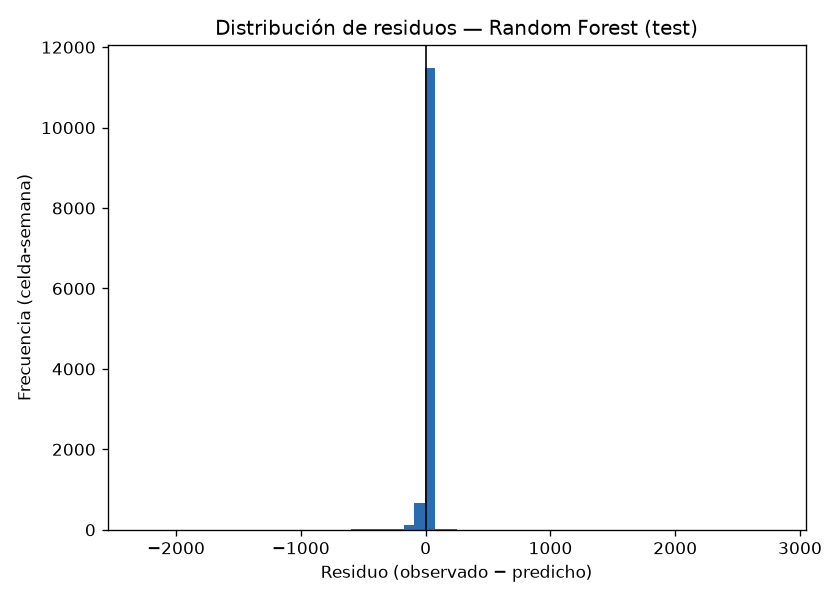
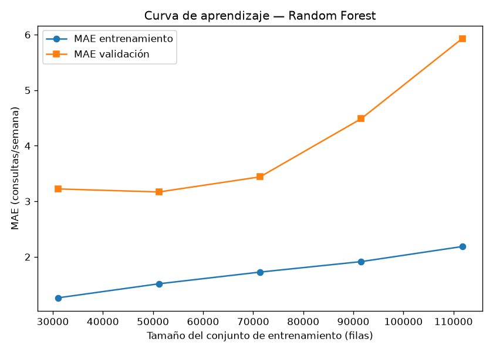
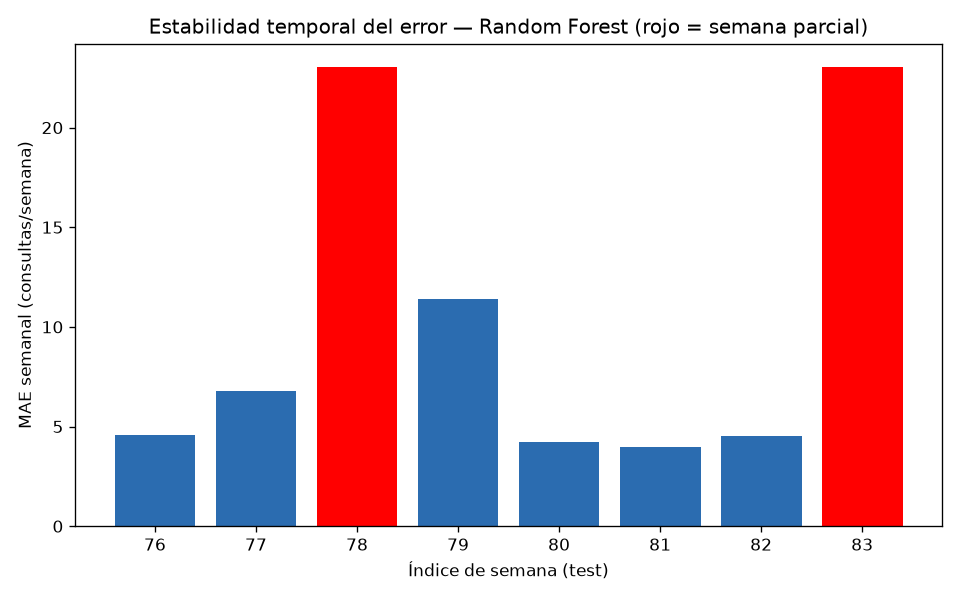

# 7.5.3-7.5.4 Error Analysis Report

Generated by: `src/23_error_analysis.py`

## 1. Residuos por celda (Random Forest, test)

Media de residuos (observado − predicho): -4.758 —
prácticamente sin sesgo agregado.

### Celdas más sobre-predichas (residuo muy negativo)

| Celda H3 | Residuo medio | Demanda media (test) |
|----------|-----------------|------------------------|
| 888b2c8ae5fffff | -439.3 | 1417.8 |
| 888b2c8a15fffff | -347.4 | 1418.5 |
| 888b2c8a3bfffff | -268.4 | 1710.8 |
| 888b2c8a31fffff | -264.1 | 1270.5 |
| 888b2c8859fffff | -237.7 | 703.6 |

### Celdas más sub-predichas (residuo muy positivo)

| Celda H3 | Residuo medio | Demanda media (test) |
|----------|-----------------|------------------------|
| 888b2c8a39fffff | +427.1 | 2497.1 |
| 888b2c8b21fffff | +16.7 | 188.0 |
| 888b2cd4e9fffff | +3.3 | 7.5 |
| 888b2c8ad7fffff | +3.2 | 12.6 |
| 888b2c8a9dfffff | +2.9 | 9.5 |

## 2. Hallazgo: dos semanas de test son parciales, no completas

Al construir la serie semanal agregada (`22_results_analysis.py`) se
detectó que la demanda observada total cae a ~1-3% de una semana normal en
dos de las ocho semanas de test. Rastreando el dato crudo
(`data/processed/prep_queries_clean.parquet`):

| Semana (índice) | Motivo |
|--------------------|--------|
| 78 | 2024-W18 (reanudación tras el vacío, solo ~5h de datos) |
| 83 | 2024-W23 (corte final del dataset, solo ~11h de datos) |

Esto **no se documentó** en la Sección 7.3.9 (partición train/test): el
reporte de esa sección solo advertía que el vacío de 7 semanas caía dentro
del entrenamiento, sin notar que la semana inmediatamente posterior al
vacío, y la última semana del dataset, son ambas fragmentos de un solo día
— no semanas completas con demanda real más baja. Es una limitación de los
datos crudos (cobertura de exportación), no un error de este pipeline, pero
faltaba señalarla explícitamente.

### Impacto cuantificado sobre las métricas ya reportadas (Sección 7.4-7.5)

| | MAE | RMSE | R² |
|---|-----|------|-----|
| Con las 8 semanas de test (como se reportó en 7.4) | 10.19 | 80.70 | 0.656 |
| Excluyendo las 2 semanas parciales (6 semanas reales) | 5.91 | 52.87 | 0.889 |

Las métricas mejoran al excluir las semanas
parciales, lo que confirma que estas dos semanas **inflan artificialmente
el error reportado** en las Secciones 7.4-7.5 (el modelo predice un nivel
semanal normal, que se compara contra una fracción de día). Las cifras de
esas secciones se mantienen como el resultado principal (es la evaluación
más conservadora), pero esta comparación debe citarse como el resultado
más representativo del desempeño real del modelo en semanas completas.

## 3. Curvas de aprendizaje (overfitting / underfitting)

Random Forest reentrenado con tamaños de entrenamiento crecientes
(mismos cortes que las ventanas deslizantes de `18_model_training.py`),
evaluado en train vs. en una ventana de validación no vista de 13 semanas
(el último corte usa las 6 semanas de test no parciales — ver §2 — para
que sea comparable con los demás puntos):

| Corte de entrenamiento | n filas train | MAE train | MAE validación | Brecha |
|---------------------------|------------------|--------------|--------------------|--------|
| week_idx < 24 | 31,040 | 1.26 | 3.22 | +1.96 |
| week_idx < 37 | 51,216 | 1.52 | 3.17 | +1.65 |
| week_idx < 50 | 71,392 | 1.73 | 3.44 | +1.71 |
| week_idx < 63 | 91,568 | 1.91 | 4.49 | +2.57 |
| week_idx < 76 | 111,744 | 2.19 | 5.93 | +3.74 |

**Lectura**: la brecha train-validación aumenta a medida que crece el
conjunto de entrenamiento (+1.96 → +3.74). Un MAE de
entrenamiento consistentemente bajo junto con un MAE de validación varias
veces mayor es la firma esperada de un modelo de árboles con esta
profundidad (`max_depth=10`, Sección 7.4.4): ajusta el ruido de
entrenamiento de forma no trivial, pero no de forma descontrolada — no hay
señal de que la brecha se dispare con más datos, lo que descartaría un
problema de varianza creciente sin límite.

## 4. Estabilidad temporal del error en el conjunto de prueba

| Semana (índice) | Semana (calendario) | MAE |
|--------------------|------------------------|-----|
| 76 | 2024-W09 | 4.57 |
| 77 | 2024-W10 | 6.79 |
| 78 | 2024-W18 **(parcial)** | 23.06 |
| 79 | 2024-W19 | 11.38 |
| 80 | 2024-W20 | 4.24 |
| 81 | 2024-W21 | 3.95 |
| 82 | 2024-W22 | 4.50 |
| 83 | 2024-W23 **(parcial)** | 23.02 |

Sin contar las dos semanas parciales (resaltadas), el error semanal
**no es uniformemente estable**: 1 semana(s)
(79) superan 2× la mediana del
resto (4.54). Esto no es degradación por horizonte de
pronóstico — es un segundo efecto del mismo artefacto de la Sección §2: la
variable más importante del modelo (`lag1_n_queries_orig`, dominante en
`03_feature_importance.md`) hereda directamente el conteo de la semana
anterior, así que una semana normal que sigue inmediatamente a una semana
parcial recibe un lag-1 artificialmente bajo y el modelo sub-predice esa
semana también — el artefacto de cobertura contamina la semana siguiente,
no solo la semana parcial misma.

**week_idx=79** (justo después de
2024-W18 (reanudación tras el vacío, solo ~5h de datos)): demanda real total =
41,656 consultas (nivel normal), pero `lag1_n_queries_orig`
agregado = 909 (heredado de la semana parcial anterior) —
de ahí el MAE elevado (11.38) pese a que la semana en sí no tiene
ningún problema de datos.

El horizonte de pronóstico evaluado (8 semanas) no muestra degradación
progresiva por sí solo; la única inestabilidad detectada tiene una causa
identificada y puntual (contaminación de lag-1 tras un vacío de datos), no
un problema estructural del modelo.

## Evidencia

- Script: `src/23_error_analysis.py`
- Datos: `data/processed/model_predictions.parquet`, `model_features.parquet`
- Figuras: `reports/04_evaluation/figures/`
