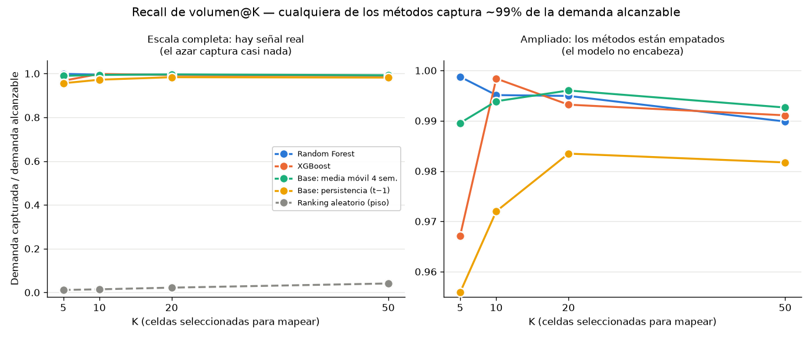

# 7.5.5 Métricas de ranking — ¿sirve el modelo para priorizar?

Generado por: `src/26_ranking_metrics.py`

## Por qué esta sección existe

La Sección 7.4 evaluó el modelo como predictor de valor (MAE/RMSE/R²) y encontró
una mejora modesta (~8%) sobre la línea base estacional. Esta sección pone a
prueba la afirmación que justificaría el modelo operativamente: *"aunque no
acierte el valor exacto, ordena bien las celdas, así que sirve para decidir
cuáles mapear primero."*

## Criterio preinscrito

Declarado **antes** de mirar los resultados, para que la conclusión no sea una
racionalización posterior:

> El modelo sirve para priorizar si ordena mejor que la media móvil de 4
> semanas: diferencia media positiva en recall de volumen@K y NDCG@K sobre las
> semanas completas de test, con signo consistente y una prueba pareada que no
> lo contradiga.

**Resultado: el criterio NO SE CUMPLE.**

## Métricas empleadas y por qué

| Métrica | Qué mide | Por qué esta y no MAE |
|---|---|---|
| **Recall de volumen@K** (principal) | Demanda capturada por las K celdas elegidas ÷ demanda de las K ideales | Continua, inmune a empates, y se lee como decisión: "mapear estas K celdas alcanza X% de la demanda alcanzable" |
| Precision@K | Coincidencia con el top-K observado | Como ambos conjuntos tienen tamaño K, precision@K = recall@K; se reporta una sola vez |
| NDCG@K | Calidad del orden, penalizando aciertos en posiciones bajas | Con conteos crudos satura en 0,97-0,99 para todos (3 celdas dominan el total); se usa relevancia `log1p` |
| Kendall τ-b + ρ de Spearman | Correlación de rangos | Restringidas a celdas con demanda media de entrenamiento ≥ 5 |

**Nota sobre empates**: el 76.6% de las filas celda-semana de test
tiene demanda cero, y en una semana típica hay ~140 valores distintos entre
1.552 celdas. Una correlación de rangos sobre todas las celdas está dominada por
ese bloque de empates, por eso se restringe a las 212 celdas
sobre el piso de demanda (fracción de empates remanente: 37.6%).

## Resultados (promedio sobre las 6 semanas completas de test)

| Método | vRecall@10 | vRecall@20 | vRecall@50 | NDCG@20 | P@20 | ρ | τ-b |
|---|---|---|---|---|---|---|---|
| Base: media móvil 4 sem. | 0.994 | 0.996 | 0.993 | 0.999 | 0.942 | 0.966 | 0.853 |
| Ridge | 0.996 | 0.996 | 0.991 | 0.991 | 0.933 | 0.927 | 0.785 |
| Lasso | 0.996 | 0.996 | 0.991 | 0.993 | 0.933 | 0.916 | 0.771 |
| Random Forest | 0.995 | 0.995 | 0.990 | 0.996 | 0.933 | 0.966 | 0.850 |
| XGBoost | 0.998 | 0.993 | 0.991 | 0.997 | 0.933 | 0.963 | 0.843 |
| Base: persistencia (t−1) | 0.972 | 0.983 | 0.982 | 0.994 | 0.892 | 0.925 | 0.800 |
| Ranking aleatorio (piso) | 0.014 | 0.022 | 0.041 | 0.104 | 0.012 | 0.002 | 0.001 |

## Contraste preinscrito: Random Forest vs. Base: media móvil 4 sem.

| Métrica | Δ media (modelo − base) | Semanas a favor | p (Wilcoxon pareado) |
|---|---|---|---|
| `vrecall@20` | -0.0011 | 0/6 | 0.500 |
| `ndcg@20` | -0.0024 | 0/6 | 0.031 |
| `precision@20` | -0.0083 | 0/6 | 1.000 |
| `spearman_active` | +0.0003 | 3/6 | 0.688 |

Con 6 semanas, la prueba pareada tiene poca potencia; por eso se
reporta también el patrón de signos y no solo el valor p.

## ¿Algún corte discrimina entre métodos?

Si el ordenamiento global es fácil, quizá el modelo aporte donde el problema es
difícil. Se probaron dos cortes:

| Método | ρ en el estrato medio (rangos 21-200) | ρ de los **cambios** semana a semana |
|---|---|---|
| Random Forest | 0.957 | 0.458 |
| Base: media móvil 4 sem. | 0.958 | 0.514 |
| XGBoost | 0.953 | 0.368 |

El ranking de cambios es la prueba más exigente: mide si el método anticipa
**qué celdas suben o bajan**, que es justo lo que la persistencia no puede
obtener gratis. (La línea base de persistencia se excluye de esa columna: su
cambio predicho es constante cero por construcción, así que la métrica no está
definida para ella.)

## Interpretación

El mejor ordenador por recall de volumen@20 es **Base: media móvil 4 sem.**
(0.996), pero la distancia entre métodos es
irrelevante para la decisión: todos capturan ~99% de la demanda alcanzable con
las mismas K celdas, y todos están muy por encima del piso aleatorio.

**La conclusión honesta es que el reencuadre no rescata al modelo.** La demanda
es tan persistente (Gini 0,934, Sección 7.3.8) que una media móvil de 4 semanas
ordena las celdas igual de bien o mejor que Random Forest, y ningún corte
—estrato medio ni ranking de cambios— separa a los métodos.

Esto **no invalida el trabajo**: es un resultado en sí mismo, y de los que se
defienden bien porque se obtuvo con un criterio declarado de antemano y una
comparación que podía salir en contra. Dice algo útil sobre el problema: para
decidir dónde mapear rutas, **no hace falta un modelo complejo**; basta una
media móvil, que además es transparente, barata de operar y fácil de auditar.
La contribución de la monografía está en el pipeline reproducible, la
caracterización territorial y el diagnóstico de cobertura (H1), no en la
superioridad de un estimador.

## Limitación: esto refuta el aporte a horizonte 1 semana

Todas las comparaciones son a **h = 1 semana**. A horizontes mayores la media
móvil se degrada (su información envejece) mientras que un modelo con variables
territoriales y estacionales podría no hacerlo. Esa es la única vía por la que
el modelo aún podría mostrar ventaja, y **no se probó aquí**: requiere
reconstruir las variables de rezago a h = 2, 3, 4 semanas y reentrenar. Queda
declarado como la prueba pendiente, no como una ventaja supuesta.

## Evidencia

- Script: `src/26_ranking_metrics.py`
- Datos: `data/processed/ranking_metrics.parquet` (métricas por semana y modelo)
- Figura: `reports/04_evaluation/figures/ranking_comparison.png`
