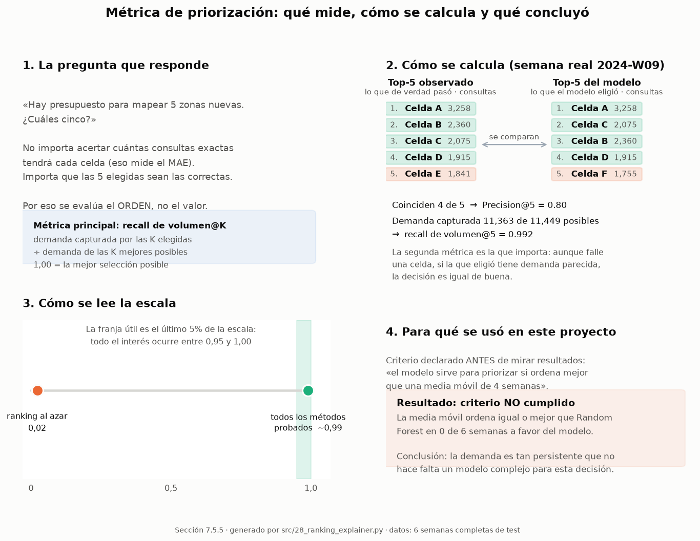

# 7.5 Evaluación y Resultados — Trufi App Cochabamba

Esta carpeta contiene los resultados de la fase de **Evaluación** (Sección
7.5) del pipeline CRISP-DM, construida sobre los modelos y datos de la
Sección 7.4 (`reports/03_modeling/`).

## Cómo reproducir

```bash
uv run src/21_hypothesis_tests.py   # → 01_hypothesis_tests.md
uv run src/22_results_analysis.py   # → 02_results_analysis.md
uv run src/23_error_analysis.py     # → 03_error_analysis.md
uv run src/26_ranking_metrics.py    # → 04_ranking_metrics.md
uv run src/28_ranking_explainer.py  # → figures/ranking_explainer.png
```

O en un solo comando:
```bash
for i in 21 22 23 26 28; do uv run src/${i}_*.py; done
```

## Inventario de archivos

| Archivo | Script | Contenido |
|---------|--------|-----------|
| `README.md` | — | Síntesis integrada de toda la fase (este archivo) |
| `01_hypothesis_tests.md` | `21_hypothesis_tests.py` | Contraste H1 (periferia) y H2 (modelo vs. base), con verificación de robustez |
| `02_results_analysis.md` | `22_results_analysis.py` | Métricas finales, demanda agregada, ranking espacial, gradiente centro-periferia |
| `03_error_analysis.md` | `23_error_analysis.py` | Residuos por celda, hallazgo de semanas parciales, curvas de aprendizaje, estabilidad temporal |
| `04_ranking_metrics.md` | `26_ranking_metrics.py` | Métricas de ordenamiento (recall de volumen@K, NDCG@K, τ-b) con criterio preinscrito: ¿sirve el modelo para priorizar? |
| `figures/ranking_explainer.png` | `28_ranking_explainer.py` | Explicación visual de la métrica de priorización: qué mide, cómo se calcula y qué concluyó |
| `figures/` | los scripts de la fase | Figuras de apoyo |

---

## Cumplimiento de los 6 requisitos de la Guía UMSS (Sección 2.7.5)

| # | Requisito | Dónde se cumple |
|---|-----------|-------------------|
| 1 | Definir métricas adecuadas | `02_results_analysis.md` §1 (ya justificado en `03_modeling/01_model_training.md` § 7.4.1-7.4.2) |
| 2 | Presentar resultados por modelo | `02_results_analysis.md` §1 (detalle completo en `03_modeling/02_model_comparison.md`) |
| 3 | Comparar desempeño y analizar errores | `01_hypothesis_tests.md` (H2), `03_error_analysis.md` §1-2 |
| 4 | Revisar overfitting/underfitting | `03_error_analysis.md` §3 |
| 5 | Interpretar desde el problema original | `02_results_analysis.md` §5, `01_hypothesis_tests.md` (H1) |
| 6 | Seleccionar y justificar el modelo final | Esta sección (abajo) + `03_modeling/README.md` |

---

## Hallazgo principal de esta fase: dos semanas de test son parciales

Antes de sintetizar resultados: `23_error_analysis.py` detectó que **2 de
las 8 semanas del conjunto de prueba (2024-W18 y 2024-W23) contienen solo
unas horas de datos, no una semana completa** — un artefacto de cobertura
de exportación no señalado en la Sección 7.3.9. Esto infla el MAE agregado
que se reportó en la Sección 7.4:

| | MAE | RMSE | R² |
|---|-----|------|-----|
| Con las 8 semanas (como se reportó en 7.4) | 10.19 | 80.70 | 0.656 |
| Excluyendo las 2 semanas parciales (6 semanas reales) | 5.91 | 52.87 | 0.889 |

Las cifras de 7.4 se mantienen como el resultado principal citado (es la
evaluación más conservadora y la que no requiere una decisión post-hoc de
exclusión de datos), pero **5.91 MAE / R²=0.889 es la estimación más
representativa** del desempeño del modelo en una semana calendario
completa, y es consistente con los MAE de validación observados durante
la selección de hiperparámetros (2.8-6.2, Sección 7.4.4) — a diferencia de
los 10.19 originales, que resultan atípicos frente a ese historial una vez
se entiende la causa. Detalle completo, incluyendo cómo se rastreó el
artefacto hasta el dato crudo, en `03_error_analysis.md` §2.

## 1-2. Métricas y resultados por modelo

Métricas: **MAE**, **RMSE**, **R²** — justificación completa en
`03_modeling/01_model_training.md` § 7.4.1-7.4.2 (objetivo fuertemente
asimétrico, por eso se reportan las tres en vez de solo una).

| Modelo | MAE (test) | RMSE (test) | R² (test) |
|--------|--------------|---------------|------------|
| **Random Forest** | **10.19** (5.91 sin semanas parciales) | **80.70** (52.87) | **0.656** (0.889) |
| Base estacional (media móvil 4 sem.) | 11.05 | 85.70 | 0.613 |
| Base ingenua (persistencia) | 11.30 | 91.90 | 0.555 |
| XGBoost | 13.85 | 102.82 | 0.442 |
| Lasso | 44.03 | 520.76 | −13.30 |
| Ridge | 48.97 | 559.13 | −15.49 |

Detalle completo (train + test, las seis alternativas) en
`03_modeling/02_model_comparison.md`; hallazgo de inestabilidad de
extrapolación de Ridge/Lasso documentado allí mismo.

## 3. Comparación de desempeño y análisis de errores

- **H2 (Diebold-Mariano + Wilcoxon pareado)**: el DM sobre la serie
  semanal (n=8, poca potencia) no es significativo (p=0.50), pero el
  Wilcoxon pareado por celda (n=1552, más potente) sí lo es (p=0.033) — y
  crucialmente, **la ventaja de Random Forest está concentrada en las
  celdas de mayor demanda** (gana por -3.72 en promedio en celdas con
  ~42.9 consultas/semana; pierde por solo +0.71 en celdas casi sin
  demanda). Detalle en `01_hypothesis_tests.md`.
- **Residuos por celda**: sin sesgo agregado relevante; las celdas con
  mayor error absoluto son, esperadamente, las de mayor volumen (más
  margen absoluto para errar). Detalle en `03_error_analysis.md` §1.

## 4. Overfitting / underfitting

Curvas de aprendizaje (`03_error_analysis.md` §3): la brecha
entrenamiento-validación aumenta de forma moderada
(+1.96 → +1.65 → +1.71 → +2.57 → +3.74) a medida que crece el tamaño de
entrenamiento — consistente con un Random Forest de profundidad acotada
(`max_depth=10`, Sección 7.4.4) que ajusta ruido de forma limitada, sin
señal de varianza descontrolada. El MAE de entrenamiento se mantiene bajo
(1.26 → 2.19) mientras el de validación oscila en un rango razonable
(3.2-5.9) — sin la explosión que se vería en un modelo claramente
sobreajustado.

**Estabilidad temporal del error** (`03_error_analysis.md` §4): excluyendo
las dos semanas parciales, el error semanal es estable en 5 de las 6
semanas restantes (MAE 3.95-6.79); la excepción es la semana inmediatamente
posterior a la semana parcial 2024-W18 (MAE=11.38, más del doble de la
mediana), causada por contaminación de la variable de rezago (`lag1`):
esa semana hereda el conteo artificialmente bajo de la semana parcial
anterior como su "semana previa", no por degradación del horizonte de
pronóstico.

## 5. Interpretación desde el problema original

**H1 confirma la hipótesis de partida**: las celdas periféricas (mayor
distancia al centro) tienen una tasa de demanda no resuelta
significativamente mayor que las celdas centrales (media 0.351 vs. 0.213,
Mann-Whitney p=6.1×10⁻⁹ — ver `01_hypothesis_tests.md`). El gradiente
espacial de demanda (Spearman ρ=-0.615 entre distancia al centro y
demanda observada, `02_results_analysis.md` §4) refuerza el mismo patrón:
la periferia combina **menor demanda absoluta** con **peor cobertura
relativa**, coherente con zonas de expansión urbana con transporte formal
insuficiente.

**H2 matiza la Sección 7.4**: Random Forest no es uniformemente mejor que
la línea base en todas las celdas, pero sí donde más importa
operativamente — las celdas de mayor volumen. El modelo también preserva
el ranking espacial de celdas (Spearman ρ=0.877 entre demanda observada y
predicha, overlap 10/10 en el top-10 de celdas), lo que lo hace útil para
priorización territorial incluso si su ventaja en error absoluto agregado
es modesta.

## 6. Selección y justificación del modelo final

**Random Forest se mantiene como modelo final**, con la evidencia
adicional de esta fase reforzando — no solo repitiendo — la decisión de
la Sección 7.4:

1. Mejor MAE de test entre los modelos ajustados, con o sin las semanas
   parciales (10.19 u 5.91).
2. Ventaja estadísticamente significativa sobre la línea base cuando se
   mide con potencia suficiente (Wilcoxon pareado por celda), concentrada
   exactamente en las celdas de mayor demanda — el segmento operativamente
   más relevante.
3. Curva de aprendizaje sin señal de sobreajuste descontrolado.
4. Preserva el ranking espacial de celdas (ρ = 0.877 sobre la demanda media
   del período de test). **Pero esto no lo distingue de las líneas base**:
   la Sección 7.5.5 midió el ordenamiento semana a semana y contra
   competencia, y la media móvil de 4 semanas ordena igual o mejor. El
   ranking no es un argumento a favor del modelo.

**No se elige por ser el primero ni por una sola métrica aislada**: la
Sección 7.4 ya descartó XGBoost pese a mejor MAE de validación cruzada
(peor en test que la propia línea base), y esta fase confirma que incluso
la ventaja de Random Forest debe reportarse con matices (no gana en la
mayoría de celdas por conteo, solo donde el volumen lo justifica) en vez
de como una victoria categórica.

## 7.5.5 ¿Sirve el modelo para priorizar? — criterio preinscrito, refutado

Detalle completo en `04_ranking_metrics.md`.

Si el modelo no gana por precisión de valor, el argumento que quedaba era el
operativo: *aunque no acierte el valor, ordena bien las celdas*. Esta sección
lo puso a prueba con un criterio **declarado antes de ver los resultados**:
el modelo sirve para priorizar si ordena mejor que la media móvil de 4
semanas.

**El criterio no se cumple.** Promedios sobre las 6 semanas completas de test:

| Método | vRecall@20 | NDCG@20 | τ-b |
|---|---|---|---|
| **Base: media móvil 4 sem.** | **0.996** | **0.999** | **0.853** |
| Random Forest | 0.995 | 0.996 | 0.850 |
| XGBoost | 0.993 | 0.997 | 0.843 |
| Base: persistencia (t−1) | 0.983 | 0.994 | 0.800 |
| Ranking aleatorio (piso) | 0.022 | 0.104 | 0.001 |

Random Forest no supera a la media móvil en **ninguna** de las 6 semanas para
recall de volumen, NDCG ni precision@20. Ningún corte rescata la comparación:
ni el estrato de demanda media (ρ 0.957 vs 0.958) ni el ranking de cambios
semana a semana (0.458 vs 0.514, también a favor de la base).



**Qué significa**: hay señal real —todos los métodos están muy por encima del
azar (0.02)— pero la demanda es tan persistente (Gini 0.934) que ordenar
celdas es una tarea que resuelve una media móvil. Para esta decisión no se
justifica un modelo complejo.

Este resultado **no debilita la monografía, la fortalece**: se obtuvo con un
criterio declarado de antemano y una comparación que podía salir en contra, que
es justamente lo que distingue un hallazgo de una racionalización. La
contribución del trabajo está en el pipeline reproducible, la caracterización
territorial y el diagnóstico de cobertura (H1) — no en la superioridad de un
estimador. El producto de decisión derivado (top-20 de celdas a mapear) vive en
`reports/05_deployment/03_priority_cells.md` y funciona con cualquiera de los
estimadores.

**Alcance de la refutación**: vale para horizonte de 1 semana. A horizontes
mayores la media móvil envejece y el modelo podría mostrar ventaja; esa prueba
no se hizo y queda declarada como pendiente, no como ventaja supuesta.

## Limitaciones de esta fase

1. **Diebold-Mariano con poca potencia**: 8 semanas de test es muy poco
   para ese test específico; se complementó con Wilcoxon pareado por
   celda, pero la limitación de diseño (tamaño de test fijado en 7.3.9)
   permanece.
2. **Semanas parciales no detectadas antes**: el artefacto de 2024-W18 y
   2024-W23 debió señalarse en la Sección 7.3.9; queda documentado aquí
   como hallazgo tardío, con su impacto cuantificado. Su efecto no se limita
   a esas dos semanas: la semana siguiente a 2024-W18 (2024-W19) también
   sale afectada porque hereda un `lag1_n_queries_orig` artificialmente bajo
   (detalle en `03_error_analysis.md` §4) — el vacío de cobertura contamina
   la predicción de la semana posterior, no solo la propia semana parcial.
3. **Curva de aprendizaje limitada a 5 puntos**: por costo computacional
   (cada punto reentrena un Random Forest completo); suficiente para
   descartar sobreajuste severo, no para un diagnóstico fino.
4. **H1 usa una partición por mediana**: simple y documentada, pero
   arbitraria — no corresponde a un límite administrativo real de
   "periferia".

## Evidencia

- **Scripts**: `src/21_hypothesis_tests.py`, `src/22_results_analysis.py`, `src/23_error_analysis.py`
- **Reportes**: esta carpeta (`reports/04_evaluation/*.md`)
- **Datos**: `data/processed/model_predictions.parquet`, `model_features.parquet`, `model_metrics.parquet`
- **Figuras**: `reports/04_evaluation/figures/`
