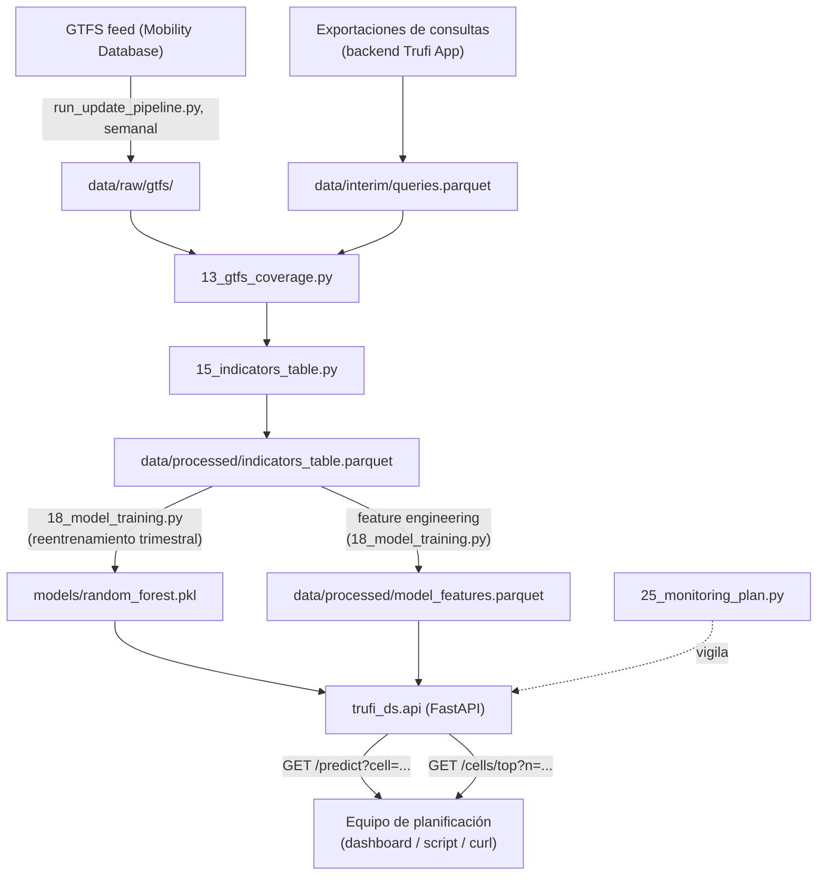

# 7.6.1-7.6.3 Deployment Architecture and Prototype

Generated by: `src/24_deployment_architecture.py`

## 1. Cómo se usaría el resultado en un contexto real

El resultado del modelo — demanda de consultas esperada por celda H3 y
semana — es una **capa analítica de priorización territorial**, no un
reemplazo de decisión humana. Dos usos concretos, ambos ya respaldados por
hallazgos de fases anteriores:

1. **Priorización de intervención de cobertura GTFS**: cruzando la
   predicción de demanda con `pct_uncovered_orig` (Sección 7.3.7) y el
   hallazgo H1 (Sección 7.5: la periferia tiene una brecha de cobertura
   significativamente mayor), el equipo de planificación de transporte
   puede rankear celdas por "demanda esperada × falta de cobertura" en vez
   de revisar las 1,552 celdas manualmente.
2. **Monitoreo de demanda emergente**: como el modelo preserva el ranking
   espacial de celdas (Spearman ρ=0.877, Sección 7.5 `02_results_analysis.md`
   §3), sirve para detectar qué celdas están *subiendo* de posición en el
   ranking semana a semana — señal temprana de una zona en expansión antes
   de que el volumen absoluto sea grande.

No se propone automatizar decisiones de ruteo: el MAE de test (10.19,
o 5.91 en semanas completas — Sección 7.5) implica error real por celda,
y el propio hallazgo H2 (Sección 7.5) muestra que la ventaja del modelo se
concentra en celdas de alta demanda, no en todas.

## 2. Prototipo: servicio de predicción (FastAPI)

Se implementó un **servicio real y ejecutable**, no solo un diagrama:
`src/trufi_ds/api.py`, que carga el modelo final (`models/random_forest.pkl`,
Sección 7.4) y `data/processed/model_features.parquet` para reconstruir,
para cualquier celda, el vector de features de la *semana siguiente a la
última observada* — usando exactamente la misma lógica de ingeniería de
características que `18_model_training.py` (perfil territorial, centralidad,
estacionalidad cíclica, variables autoregresivas), no una aproximación.

```bash
uv run uvicorn trufi_ds.api:app --reload --port 8000
```

### Arquitectura



Cada caja ya existe como código en este repo — el diagrama documenta cómo
se conectarían en producción, no un plan aspiracional.

## 3. Cómo se consumiría (ejemplos reales, no hipotéticos)

Los siguientes son **responses reales** obtenidos ejecutando el servicio
en proceso (`fastapi.testclient.TestClient`) contra los datos y el modelo
actuales de este repositorio — no ejemplos inventados.

### `GET /health`

```json
{
  "status": "ok",
  "model": "random_forest",
  "test_mae": 10.189877618387117,
  "test_r2": 0.6564742012872097,
  "n_cells": 1552
}
```

### `GET /predict?cell=888b2c8ae5fffff` (celda central, alta demanda)

```json
{
  "h3_cell": "888b2c8ae5fffff",
  "predicted_year": 2024,
  "predicted_week": 24,
  "predicted_n_queries_orig": 737.0,
  "based_on_last_observed": "2024-W23",
  "model": "random_forest",
  "model_test_mae": 10.19,
  "features_used": {
    "dist_gtfs_mean_orig_m": 24.605744385628434,
    "pct_uncovered_orig": 0.0,
    "mean_trip_dist_m": 3570.373678711846,
    "pct_weekend_orig": 0.20300361945277837,
    "pct_morning_rush_orig": 0.14568503327973295,
    "pct_evening_rush_orig": 0.1905734626818964,
    "dist_center_km": 2.203877132251168,
    "week_sin": 0.23931566428755768,
    "week_cos": -0.970941817426052,
    "week_idx": 84,
    "lag1_n_queries_orig": 57.0,
    "lag4_n_queries_orig": 1968.0,
    "roll_mean4_n_queries_orig": 1333.75
  }
}
```

### `GET /predict?cell=888b2c80d5fffff` (celda periférica, baja demanda)

```json
{
  "h3_cell": "888b2c80d5fffff",
  "predicted_year": 2024,
  "predicted_week": 24,
  "predicted_n_queries_orig": 8.2,
  "based_on_last_observed": "2024-W23",
  "model": "random_forest",
  "model_test_mae": 10.19,
  "features_used": {
    "dist_gtfs_mean_orig_m": 80.89730734850512,
    "pct_uncovered_orig": 0.0,
    "mean_trip_dist_m": 14511.33926486333,
    "pct_weekend_orig": 0.23529411764705882,
    "pct_morning_rush_orig": 0.058823529411764705,
    "pct_evening_rush_orig": 0.1111111111111111,
    "dist_center_km": 17.16842464280766,
    "week_sin": 0.23931566428755768,
    "week_cos": -0.970941817426052,
    "week_idx": 84,
    "lag1_n_queries_orig": 1.0,
    "lag4_n_queries_orig": 10.0,
    "roll_mean4_n_queries_orig": 8.5
  }
}
```

### `GET /predict?cell=celda_inexistente` → error controlado

HTTP 404: `{'detail': 'Celda desconocida (sin historial): celda_inexistente'}`

### `GET /cells/top?n=5` — priorización territorial

```json
{
  "predicted_year": 2024,
  "predicted_week": 24,
  "top_cells": [
    {
      "h3_cell": "888b2c8a3bfffff",
      "predicted_n_queries_orig": 782.0
    },
    {
      "h3_cell": "888b2c8a39fffff",
      "predicted_n_queries_orig": 779.9
    },
    {
      "h3_cell": "888b2c8a15fffff",
      "predicted_n_queries_orig": 763.8
    },
    {
      "h3_cell": "888b2c8ae5fffff",
      "predicted_n_queries_orig": 737.0
    },
    {
      "h3_cell": "888b2c8a31fffff",
      "predicted_n_queries_orig": 732.3
    }
  ]
}
```

## Limitación operativa detectada al construir el prototipo

Al probar `/predict` sobre la celda hotspot `888b2c8ae5fffff`, su
`lag1_n_queries_orig` (heredado de la última semana observada, 2024-W23)
resulta **57**, muy por debajo de su media móvil de 4
semanas (**1334**) — confirmado
como el mismo artefacto de semana parcial documentado en la Sección 7.5
(`03_error_analysis.md` §2/§4): **2024-W23 es la última semana del dataset
completo, y es en sí misma una semana parcial** (~11h de datos). Esto
significa que **la primera predicción en vivo tras este dataset heredará
esa misma contaminación de lag-1** para todas las celdas, no solo para el
ejemplo mostrado.

**Recomendación antes de un primer despliegue real**: completar (backfill)
la semana 2024-W23 con datos reales de esa semana calendario completa antes
de servir la primera predicción en producción, o aceptar explícitamente un
primer ciclo de error elevado — documentado aquí en vez de descubierto en
producción.

## Evidencia

- Servicio: `src/trufi_ds/api.py`
- Script: `src/24_deployment_architecture.py`
- Modelo: `models/random_forest.pkl`
- Datos: `data/processed/model_features.parquet`
