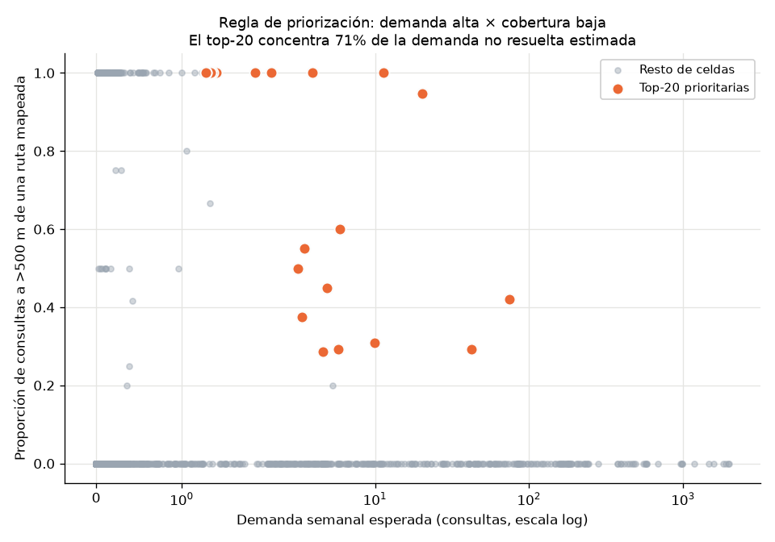

# 7.6.3 Celdas prioritarias para mapeo

Generado por: `src/27_priority_cells.py`

## La regla de decisión

```
demanda_no_resuelta  =  demanda semanal esperada  ×  tasa de no cobertura
```

Responde la pregunta operativa de la Sección 7.6: *si hay presupuesto para
mapear N zonas, ¿cuáles?* Una celda entra al top por combinar **mucha demanda**
con **poca cobertura GTFS**; una celda con mucha demanda ya bien cubierta no
necesita mapeo, y una celda sin cobertura pero sin demanda tampoco es urgente.

### Tres precisiones que evitan malinterpretar esta tabla

1. **Esto es una regla de decisión, no una métrica del modelo.**
   `pct_uncovered_orig` es una condición territorial **observada**, no una
   predicción. El producto de ambas nunca se validó como salida del modelo y no
   debe leerse como desempeño predictivo.
2. **La tasa de no cobertura es anterior a la decisión.** Se usa la mediana de
   cada celda en el período de **entrenamiento**, no el valor de la semana que
   se está decidiendo — usar el de la semana objetivo sería conocer el futuro.
3. **Demanda = consultas de planificación**, es decir intención de viaje, no
   viajes realizados (Sección 7.2). Una celda con muchas consultas sin ruta
   cercana mapeada es una celda donde la gente busca cómo moverse y la app no
   tiene qué responderle.

## Top-20 de celdas prioritarias

| # | Celda H3 (r8) | Demanda esperada | No cobertura | Demanda no resuelta | Dist. al centro (km) | Dist. media a ruta (m) |
|---|---|---|---|---|---|---|
| 1 | `888b2c81e1fffff` | 74.3 | 42% | 31.3 | 7.6 | 519 |
| 2 | `888b2c81d5fffff` | 20.3 | 95% | 19.2 | 10.9 | 657 |
| 3 | `888b2c81e5fffff` | 42.5 | 29% | 12.5 | 6.7 | 379 |
| 4 | `888b2cc6c9fffff` | 11.3 | 100% | 11.3 | 14.2 | 6330 |
| 5 | `888b2c81e7fffff` | 3.9 | 100% | 3.9 | 7.4 | 925 |
| 6 | `888b2c813dfffff` | 5.9 | 60% | 3.5 | 5.1 | 420 |
| 7 | `888b2c81abfffff` | 10.0 | 31% | 3.1 | 8.9 | 455 |
| 8 | `888b2c8185fffff` | 4.9 | 45% | 2.2 | 9.0 | 501 |
| 9 | `88b32d929dfffff` | 2.1 | 100% | 2.1 | 32.5 | 6607 |
| 10 | `888b2c881bfffff` | 3.5 | 55% | 1.9 | 5.6 | 510 |
| 11 | `888b2c8e69fffff` | 1.9 | 100% | 1.9 | 12.9 | 798 |
| 12 | `888b2c81d1fffff` | 5.8 | 29% | 1.7 | 11.8 | 347 |
| 13 | `888b2cd317fffff` | 3.2 | 50% | 1.6 | 37.6 | 467 |
| 14 | `88b32d9283fffff` | 1.4 | 100% | 1.4 | 31.9 | 6576 |
| 15 | `888b2c8197fffff` | 1.4 | 100% | 1.4 | 12.1 | 633 |
| 16 | `888b2c8739fffff` | 1.3 | 100% | 1.3 | 22.5 | 1276 |
| 17 | `888b2c8115fffff` | 4.6 | 29% | 1.3 | 6.9 | 464 |
| 18 | `888b2cbb6dfffff` | 1.3 | 100% | 1.3 | 24.4 | 5233 |
| 19 | `888b2c8e63fffff` | 1.3 | 100% | 1.3 | 13.8 | 630 |
| 20 | `888b2c818dfffff` | 3.4 | 38% | 1.3 | 9.1 | 433 |

El top-20 concentra **70.5%** de toda la
demanda no resuelta estimada del área metropolitana.



### Lo que muestra la figura

Las celdas prioritarias **no son las de mayor demanda**. Las celdas con cientos
o miles de consultas semanales aparecen todas con tasa de no cobertura 0: el
núcleo de alta demanda ya está mapeado. La demanda no resuelta se concentra en
celdas de demanda baja o media (1-74
consultas/semana) que están mal cubiertas.

Es la misma conclusión que H1 (Sección 7.5) vista desde la decisión: el
problema de cobertura es periférico, y priorizar por demanda bruta —el instinto
natural— llevaría a mapear justamente donde ya no hace falta.

## Sensibilidad: ¿esta lista necesita el modelo?

| Comparación | Celdas en común (de 20) | Qué significa |
|---|---|---|
| Ranking con demanda **predicha** vs. **observada** | 16/20 | La predicción cambia la lista |
| Ranking con **Random Forest** vs. **media móvil 4 sem.** | 18/20 | El estimador elegido cambia la lista |

Esto es coherente con la Sección 7.5.5, donde el modelo no mostró ventaja de
ordenamiento sobre la media móvil. **La priorización territorial es un producto
sólido del proyecto, pero su valor está en cruzar demanda con cobertura, no en
el modelo que estima la demanda.** Cualquiera de los estimadores —incluida una
media móvil transparente y barata de operar— produce prácticamente la misma
lista de intervención.

## Cómo se consume

El endpoint `GET /cells/top?n=20` del prototipo (`src/trufi_ds/api.py`)
devuelve esta misma lista calculada en vivo sobre la última semana observada.
Los umbrales de monitoreo de `02_monitoring_plan.md` aplican igual.

## Limitaciones

- La tasa de no cobertura mide distancia a rutas **mapeadas en el GTFS de
  Trufi**, no a rutas realmente existentes: una celda "sin cobertura" puede
  tener servicio no mapeado. Es precisamente la brecha de información que el
  proyecto busca localizar, pero no debe leerse como ausencia de transporte.
- La demanda esperada proviene de consultas de la app, así que hereda su sesgo
  de adopción: zonas con menos usuarios de Trufi generan menos consultas
  aunque tengan necesidad de transporte.
- Las celdas se ordenan por volumen absoluto de demanda no resuelta, lo que
  favorece celdas densas. Una variante por *tasa* per cápita requeriría datos
  de población que el proyecto no incorpora.

## Evidencia

- Script: `src/27_priority_cells.py`
- Datos: `data/processed/priority_cells.parquet`
- Figura: `reports/05_deployment/figures/priority_quadrants.png`
